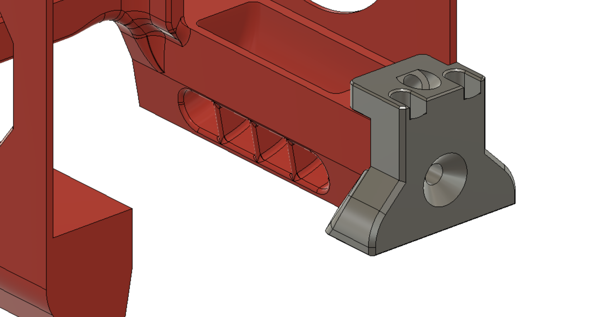
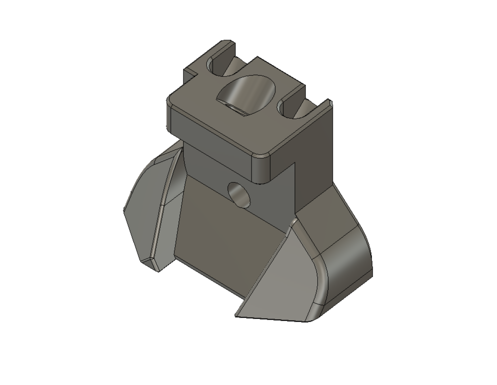
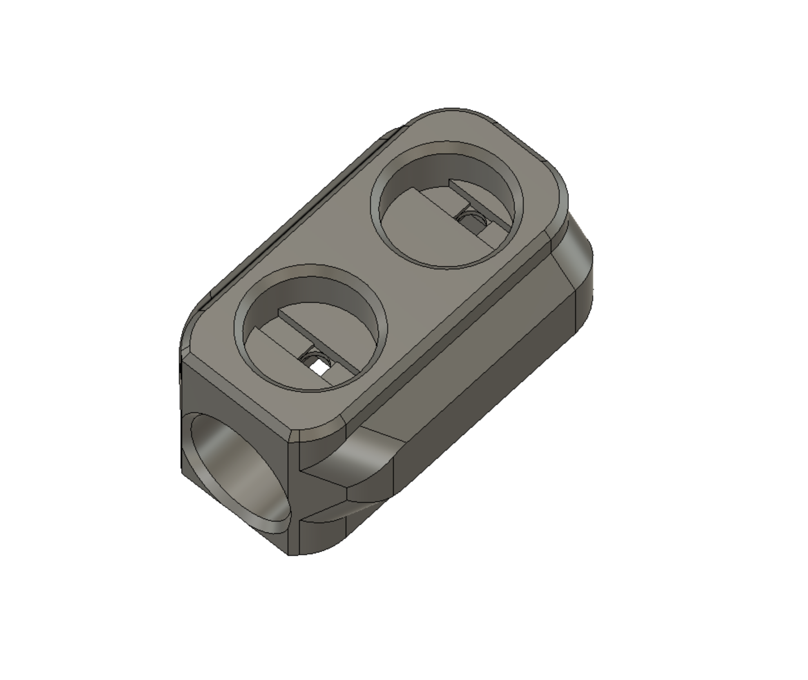
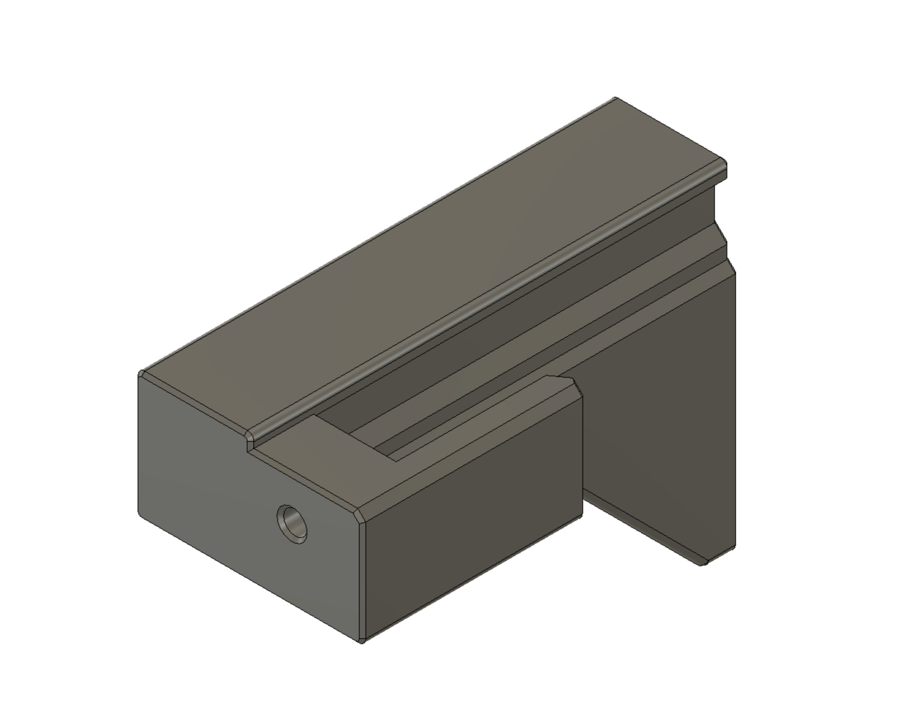
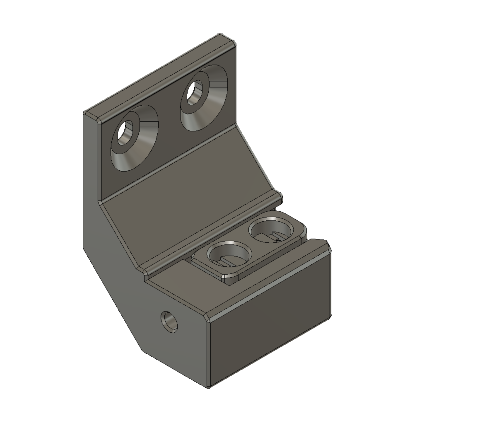
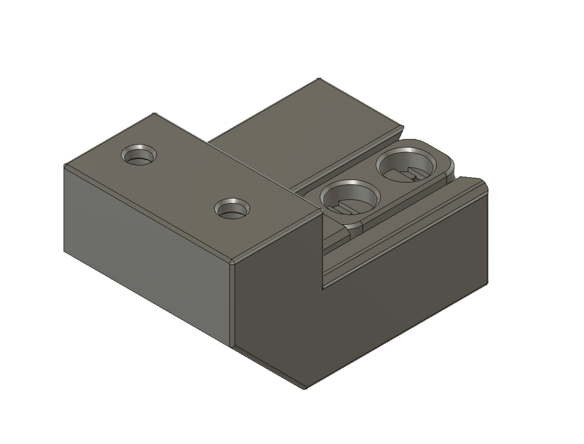
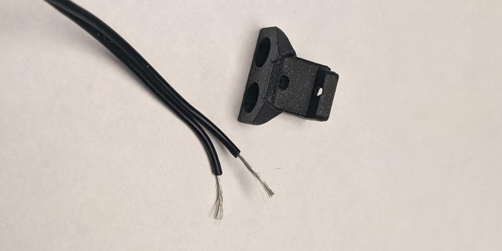
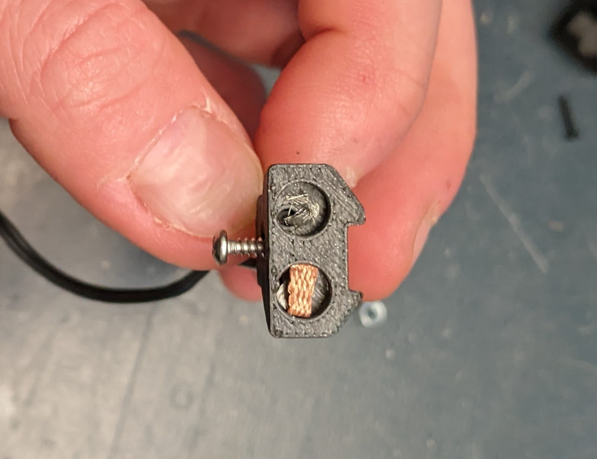
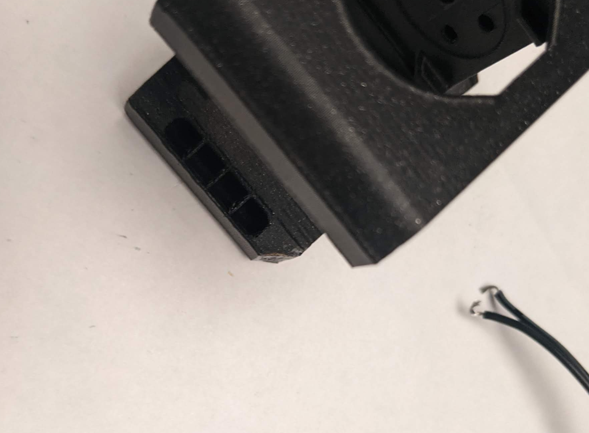
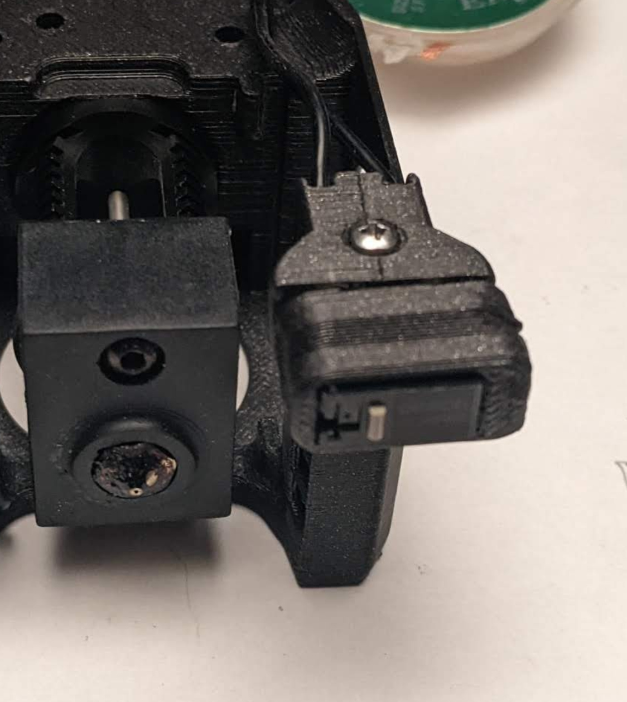

# ZeroClick - fast & simple bed probing for tiny printers
Made with :heart: by Zruncho

## Updates
* 2022-02-08 Initial alpha-1 release!  Enjoy.  It took over 10 prototypes to get here.

## See ZeroClick in action: https://youtu.be/XPtowYdHhJ8

## Why ZeroClick?

| Rear View | ZeroClick Mount | ZeroClick Probe |
| - | - | - |
|  |  |  |

**ZeroClick** is the lowest-cost and fastest-to-print-and-build bed probe solution out there for V0 and V0-ish printers.

[Klicky](https://github.com/jlas1/Klicky-Probe) inspired it, but ZeroClick is a detachable click probe that is sized right for Zero-size (1515-extrusion) printers.

Key features:
* **Fast to print**: 3 parts, under an hour.  No new toolhead to print!
* **Fast to add**: choose the most convenient dock location.  No frame dissassembly needed!
* **Minimizes lost bed area**: on the order of 4mm x 4mm!
* **Discreet**: fits behind a V0 toolhead, such as a Mini Afterburner or [Mini AfterSherpa](https://github.com/KurioHonoo/Mini-AfterSherpa).
* **Low cost**: the entire BOM is covered with V0 leftovers:
  * 5x 6mmx3mm magnets
  * 3x M3x6 BHCS
  * 2x M2 self-tapping screws
  * 1x Omron D2F-series microswitch
  * Solder wick, wire, and some crimp connectors
  * **No servos, special magnets, or PCBs needed.**

Known to be compatible with these designs:
* [Voron Zero](https://vorondesign.com/voron0.1)
* [Tri-Zero](https://github.com/zruncho3d/tri-zero)
* [Double Dragon (X0)](https://github.com/zruncho3d/double-dragon)

[F-Zero](https://github.com/zruncho3d/f-zero) is not tested yet, but it should be compatible, and other [Printers for Ants](www.3dprintersforants.com) may benefit, with small changes to the dock parts.

## Instructions

### Prep

#### Choose wisely
| Center | Rear | Side |
| - | - | - |
|  |  |  |

* Choose your preferred dock type from the 3 choices:
  * **Center**: mounts to the left side of the rear-left Z extrusions on a V0 or similar printer (T0, X0).  
    * No preloaded nuts are necessary, so this is the default option.
  * **Rear**: mounts to the front face of the rear extrusion on a V0, so you'll need pre-loaded nuts there.  
    * The benefit over Center?  This can be slid left and right, which is useful for wider V0 variants like [X0](https://github.com/zruncho3d/double-dragon).
    * Requires the least material & print time.
  * **Side**: mounts to the bottom face of the left-side Y extrusions on a V0 or similar printer, so you'll need two pre-loaded nuts there.  
     * Not an option for printers with stuff on the bottom of the Y extrusions, like [X0](https://github.com/zruncho3d/double-dragon).
* Print the dock, probe, and mount in ABS. Standard Voron settings (4 perims, 40% infill) will work, but all docks will print fine with much less material (3 perims, 13%).  Print two probes, 'cuz why not?  It's only minutes, and this gives you a backup in case you lose one or in case it splits.
* Confirm the size of magnet holes with calipers.  The CAD is sized with 0.1mm extra, which should yield something very close to 6.0mm (ideally +/- 0.05mm) when printed.  The hole should be small enough to hold the magnet without glue, but not so tight that it splits the plastic.  
* Remove the middle leg of the 3 on the microswitch, using flush cutters.
* Pop the microswitch lever off, if needed, with pliers.
* Confirm space in the probe block for the microswetch legs to go through.  If not enough, drill this hole out slightly.

### Assemble Probe Block
You'll need a small desk vise for the next steps.

|  | 
| - | -

* Insert a magnet into the end hole of the probe block - gently - then add force using the clamp, slowly, until the end magnet is just about flush with the edge of the probe block.
* Insert the microswitch into the probe block, with the tip on the opposite side from the end magnet.  Push down hard until it's fully in-place.  The leads should go through with no problem.
* Using flat needle-nose pliers or an allen wrench, push each microswitch lead flat, into the small cutout area.  Alternate the bend for these, so that the magnets don't go in at an angle.
* Cut solder wick (a.k.a. copper braid) to 3x or 2x the width of the magnet hole - so ~18mm or ~12mm.  Fold the strip of solder wick, then put it in place in the two holes.  This will help maintain a good connection, without soldering.
* Mark a line of magnets with something - like a nut or larger magnet - to help keep the polarity consistent.
* Press the two magnets in, making sure they have the same polarity.  Do this slowly, in the desk clamp, **USING THE SPACER TOOL**.  The plastic body of the microswitch can't handle the forces of a clamp.  Ask me how I know.  You'll know when the magnets are fully seated as the resistance to clamping will go up quite a bit.  Don't go too far!  You can always tighten slightly more later.
* Test the connection between the magnets and though the switch, with a multimeter.  You want, ideally, a ~1 ohm or less connection, but a few ohms will be fine.  If the connection is bad, clamp the magnets slightly more.
* Ideally, lap the magnet connection for flatness with some fine-grit sandpaper.


### Assemble Mount

|  |  |  |
| - | - | -

* Cut 2 lengths of wire, long enough to reach the toolhead, ideally from 2-wire zip wire.
* Strip about 10-12mm of each wire end.
* Push the wire through the holes.
* Twist each wire into a circle that should sit flat in the magnet pocket.
* Flip the polarity marker around (typically a nut), so that when you insert the magnet, the orientation is flipped.
* Add the magnets in a simlar method to the probe block, ensuring that both magnets are coplanar and fully inserted.


### Test Probe Block and Mount electrical connection together

* Connect the probe block and mount together, and ensure that the magnets can't rock back and forth.
* Test the electical connection quality through the full stack, with a multimeter.  If the resistance is too high, clamp harder and try again.

### Modify Toolhead and add Mount
Modifying the toolhead sounds scary, but it's easier than you may think.

Plus - even if you get it wrong, the chop goes in the back and gets covered up, so nobody will see it anyway.

No worries, YOLO, Just Do It.

|  |  | 
| - | - | -

* Remove the toolhead from the printer, at least enough to set it against something sturdy.  Wires can stay attached, if you're careful.
* Mark the back left corner of the toolhead with a 45 degree corner with 5mm height and length.  This is what you'll chop off.
* Using a hobby knife, score the line.  Press hard and rock back and forth slightly to get the cut started.  The plastic should cleave cleanly.  Use the blade to remove just enough material, including a bit of chamfering around the rear edges.
* Add the Mount piece. If it doesn't sit flat against the back edge of the toolhead shroud, double-check your cut, as well as the Mount part itself; both might require a tiny bit of knife cleanup.  Push the Mount flat against the toolhead edge.
* Once the Mount is sitting flat, lock it in place with the two self-tapping screws.  Start with one from the rear.  Push hard to get it started, then turn until it's all the way in and flush.
* Add the 45-degree-angled self-tapping screw from the back, taking care to push hard to get the thread started.
* Add whatever connectors you need to get the probe signal to a toolhead board or back to an electronics board.
* Reattach the toolhead.

### Attach Dock to Frame
* Prep the dock by adding an M3x6 BHCS to the hole near where the end magnet will go.  Tighten it in, forming threads, until the head of the screw would just touch the magnet.  The screw should be regular steel, not stainless, for magnetic reasons.
* Attachment should be straightforward enough for the Center Dock, and maybe require a bit of diassembly for the others, unless you thought ahead and added nuts preemptively.  
  * Protip: use NoDropNuts to hold the nuts in place.  All dock variants use at least a 15mm spacing between nuts to enable NoDropNut usage, as well as 2x M3x6 BHCS.
* Center Dock only: get it to the correct height, by aligning the height of the magnets on the toolhead with the probe, in the dock, pushed up to its highest position.  Then lock the two screws.
* Rear Dock only: get it to the right width, by aligning the probe to the leftmost toolhead position.

### Configure Klipper
* Configure the probe pin in your config.  Make sure the endstop detects the click with the probe added.
* Configure the bed-probing points, if needed.  Example here for [T0](https://github.com/zruncho3d/tri-zero):
 ```
   [z_tilt]
   ....
   #points:
   #   A list of X,Y coordinates (one per line; subsequent lines
   #   indented) that should be probed during a Z_TILT_ADJUST command.
   #   Specify coordinates of the nozzle and be sure the probe is above
   #   the bed at the given nozzle coordinates. This parameter must be
   #   provided.

   # Points for ZeroClick
   points:
       25, 5
       115, 5
       70, 95
```
* Add macros to attach and detach.  [Klicky macros](https://github.com/jlas1/Klicky-Probe) are recommended, but if not using those, or just looking to test attachment and detachment quickly, here are sample macros to use the Center Dock with a V0:
```
    [gcode_macro ATTACH_PROBE]
    gcode:
             
          SAVE_GCODE_STATE NAME=attach_probe_state
          T1
          G90
          G0 Z14
          G0 Y60 F{F}
          G0 X60 Y60 F{F}
          G0 X-36 Y100 F{F}
          G0 Y118.5 F{F}
          G0 X-16 F{F}
          G0 X60 Y60 F{F}
          RESTORE_GCODE_STATE NAME=attach_probe_state

    [gcode_macro DETACH_PROBE]
    gcode:
          
          SAVE_GCODE_STATE NAME=detach_probe_state
          T1
          G90
          G0 Z14
          G0 Y60 F{F}
          G0 X60 Y60 F{F}
          G0 X-16 Y118.5 F{F}
          G0 X-36 F{F}
          G0 Y100 F{F} F{F}
          G0 X60 Y60 F{F}
          RESTORE_GCODE_STATE NAME=detach_probe_state
```

Of course, make sure to change the positions above to match your printer's specific dimensions.

Finally, run HOME, then ATTACH_PROBE, then run Z_TILT or QGL or BED_MESH or whatever you want.

Enjoy!


## Known Caveats

If the toolhead grabs the probe and moves directly right, the back edge of the probe will hit the rear extrusions.

A fix is TBD, but may involve shape changes to the probe, like chopping off the rear.  For now, the workaround is to ensure that no macros or prints move the toolhead with the probe to the back.

## FAQ

### Should I trust a probe block with only two magnets?

A: On a [Tri-Zero](https://github.com/zruncho3d/tri-zero) with barely any reduction in the motors, Z_TILT reliably closes with a range well below 0.01mm.  As long as the bed magnets are flush with each other, which can be easily enabled with careful clamping, and the mount magnets are done with similar care, you'll be fine.

### Why not add a servo to avoid losing printable area?

A: Cost, noise, complexity.

### Why not just use a regular Klicky probe?

A: I tried, and I couldn't make it work with [Tri-Zero](https://github.com/zruncho3d/tri-zero), when mounted at the side or the back.  The front Z parts seem to get in the way of toolhead that needs to go all the way to the front panel to get all usable Y travel.

### Should toolheads build this in?

A: No.

Having a separate unit, which you easily put into a vise, make it easier to build and to test and to replace, if needed.

However, for toolheads similar to the Mini Afterburner (like the [Mini AfterSherpa](https://github.com/KurioHonoo/Mini-AfterSherpa)), the little 5mm x 5mm corner slice should be there by default, to save a little time.

## Credits

These parts are a spinoff from the [Tri-Zero](https://github.com/zruncho3d/tri-zero) project.

The probe block design derives from the [SideSwipe probe block](https://github.com/oldfar-t/Side-Swipe-Magnetic-Probe/blob/main/Side_Swipe_STLs/Probe_Block_v2.5.STL), with changes for easier printability.

Thanks to Red5 on the [DoomCube Discord](https://discord.gg/doomcube) for being the first beta tester!


